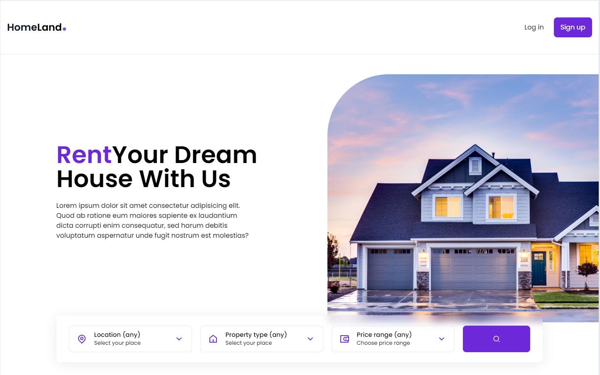

<div align="center" >
  
</div>
<br>

<p align="center">
    
</p>

# RealState WEB
Aplicação baseada no [VIDEO](https://www.youtube.com/watch?v=CHe_QJcTK5Y). 
Diferente da aplicação desenvolvida no vídeo, na minha versão, o projeto foi realizado utilizando typescript.<br>
A aplicação é um front-end desenvolvido com ViteJS, TailwindCSS, Typescript. O projeto teve como intuíto o aprendizado e a fixação de conceitos de componentização, contextos, states, hooks, routes e deploy de uma aplicação.

## 🎯 Diferenciais da minha versão
- [x] Uso de Typescript


## Instalação
Faça o clone do repositório

Instalando as dependências
```bash
npm i
```

Rodando o servidor
```bash
npm run dev
```

## Referência
[VIDEO](https://www.youtube.com/watch?v=CHe_QJcTK5Y)